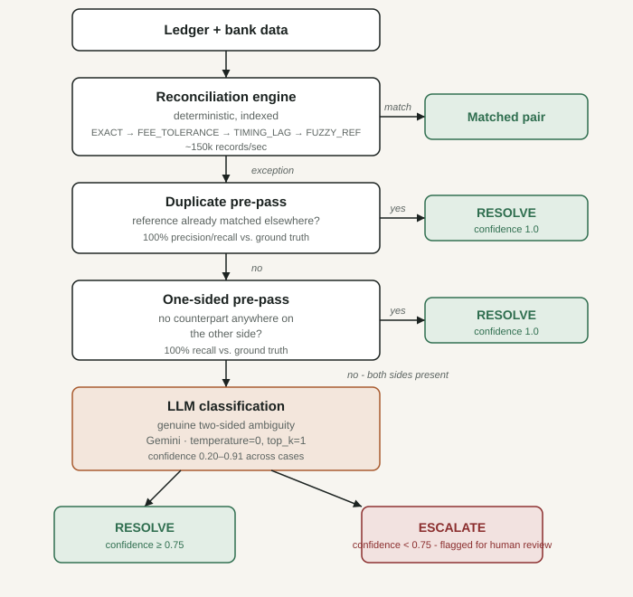

# Reconciliation agent — AI Finance Controller

Built for the Razorpay AI Buildathon, Track 4 (AI Finance Controller).

## The problem

Every merchant keeps two records of the same money: their own ledger (what
they think got paid) and the bank/PSP settlement statement (what actually got
paid). These two records almost never match perfectly — fees get deducted,
settlements lag by a few days, references get typo'd, duplicate entries sneak
in, some payments silently fail to settle. Today this gets reconciled by
someone in finance ops manually eyeballing spreadsheets. It doesn't scale and
it's error-prone.

## What this does

Given a ledger and a bank statement, the agent:

1. Matches records through four deterministic passes, most specific first
2. Deterministically resolves duplicate bookings and one-sided orphans (no
   LLM needed — these are structural, not ambiguous)
3. Sends only the genuinely ambiguous residual — a ledger row and a bank row
   for the same reference whose amounts don't reconcile under any
   deterministic rule — to an LLM for classification and confidence scoring
4. Logs every decision, matched or exception, to an audit trail
5. Reports one honest number: match rate, plus the exceptions it could not
   resolve

## Why most of this is not an AI problem

The core design decision in this project: **reconciliation is a matching
problem, not an AI problem, except at the genuine edges.** Four deterministic
passes, then two deterministic pre-passes, handle every case that has a
structural, rule-based answer. The LLM is reserved for exactly one category —
a two-sided amount mismatch where the discrepancy could be a fee, a rounding
difference, or a real problem, and no rule can tell you which without
judgment.

This wasn't the starting design — it's what we arrived at after finding,
twice, that an LLM call we'd added was actually just executing a
deterministic rule with a confidence score bolted on (see Failure Recovery
below). Using AI only where judgment is genuinely needed, and catching it
when it isn't, is the actual engineering judgment this track asks for.

## Architecture



## Results

All numbers checked against ground truth, not estimated.

| Metric | Core (60 txns) | Stress (5,000 txns) |
|---|---|---|
| Match rate | 84.96% | 80.03% |
| Throughput (indexed matching) | — | ~150,000 records/sec at 50k txns |
| Duplicate detection precision/recall | 100% (3/3) | 100% (390/390) |
| Fee-tolerance false-absorption of real mismatches | 0% (0/2), was 100% | 10.7% (45/419), was 91.2% |
| Exceptions resolved deterministically (no LLM) | 13 (76%) | 1,171 (61%) |
| Exceptions needing genuine LLM judgment | 4 rows | 748 rows |

### Why the match rate is lower than earlier numbers you might see in commit history

Earlier runs showed 88.5% (core) and 87.0% (stress). Those were wrong — the
fee-tolerance band was wide enough to silently accept some genuine amount
mismatches as clean fee deductions. We found this, quantified it exactly
(91.2% of real mismatches on stress were being absorbed), tightened the band
to match the real observed fee distribution, and the match rate dropped to
its correct, honest value. A lower correct number is worth more than a
higher wrong one, and we can explain exactly why ours changed.

## Failure recovery (real bugs found and fixed)

**1. Matching collapsed at scale.** The original matching passes compared
every unmatched ledger row against every unmatched bank row per pass —
O(n×m). Fine at 60 records (~21k records/sec), collapsing at 5,000
(~2.6k records/sec — an 8x slowdown for 85x more data). Fixed by indexing
each pass's bank-side records by the fields it actually keys on, turning
each pass into a dict lookup instead of a full scan. Verified: identical
match rate before and after, throughput improved to 200k+ records/sec at
50,000 transactions, confirmed scaling roughly linearly.

**2. The LLM's "duplicate detection" wasn't real.** Early exception
classification correctly flagged duplicate ledger bookings — but the model
was reading a synthetic ID suffix our own data generator adds to duplicated
rows, not a genuine signal. Stripped the artifact; duplicate detection
dropped to zero, confirming it had never actually been judging anything.
Realized duplicates are structurally detectable (a lone exception whose
reference already matched elsewhere) and moved detection to a deterministic
check. Verified 100% precision and recall against ground truth on both
datasets, with zero LLM calls.

**3. A wide fee-tolerance band was hiding real discrepancies.** Detailed
above — 91.2% of genuine amount mismatches on the stress set were being
silently counted as clean fee matches. Root-caused to the tolerance band
(0–3%) being wider than the real fee distribution (1.5–2.5%) our own data
generator used. Tightened the band, quantified the exact residual overlap
rather than rounding it to zero, and confirmed the four passes' throughput
was unaffected (ruled out via same-process A/B benchmarking, not a single
noisy run).

**4. An LLM classification rule was doing the LLM's job for it.** After
adding a rule telling the model which category to use based on which side
an exception came from, every classification in that category returned an
identical, suspicious confidence score (0.85) regardless of the actual
transaction. Traced to the rule itself removing all genuine ambiguity —
the model was executing a lookup, not judging anything. Moved that category
to deterministic logic (same treatment as duplicates), and reserved the LLM
for the one category that's genuinely ambiguous — a two-sided amount
mismatch with no deterministic answer. Confidence now genuinely varies by
case (confirmed: 0.35 on a small discrepancy vs. 0.65 on a larger one).

## Known limitations

- Reference IDs are assumed to contain a numeric transaction ID; a
  merchant using purely alphabetic references would need a different
  fuzzy-match strategy.
- The LLM's free-text explanation wording is not byte-identical across
  runs even at temperature=0 (a known property of hosted LLM inference) —
  only the classification, confidence, and resolve/escalate decision are
  guaranteed reproducible, which is what the audit trail actually depends on.
- Synthetic data was used throughout; real merchant data would need
  validation against this same ground-truth methodology before trusting
  the numbers above.

## Running it

```bash
python3 data/generate_data.py core       # generates a 60-txn labeled dataset
python3 data/generate_data.py stress 5000  # generates a larger unlabeled set
python3 src/reconcile.py --explain       # runs reconciliation + LLM layer on core
python3 src/reconcile.py stress --explain  # same, on the stress dataset
```

Requires `GEMINI_API_KEY` set in the environment (see `.env.example`).

## Testing

The test suite formalizes the manual ground-truth verification done during
development - it doesn't test anything new, just pins down what was already
confirmed by hand as a regression guard.

```bash
pip install -r requirements.txt pytest
pytest tests/
```

| Test file | What it locks in |
|---|---|
| `test_duplicate_detection.py` | Duplicate pre-pass catches exactly the `DUPLICATE_LEDGER` transactions in ground truth - 3/3 core, 390/390 stress |
| `test_fee_tolerance.py` | Tightened `FEE_TOLERANCE` band (1.2-2.8%) excludes `AMOUNT_MISMATCH` transactions - 0/2 core, and the known 45/419 residual overlap on stress (not zero, reported exactly) |
| `test_throughput.py` | Stress dataset reconciles well within a generous 5s bound - regression guard against the original O(n\*m) bug |
| `test_determinism.py` | Two runs of `classify_exceptions()` on identical input produce identical category and RESOLVE/ESCALATE decision (requires `GEMINI_API_KEY`; confidence is reported, not asserted exact - see the file's docstring) |

## Stack

Python, Google Gemini API (gemini-3.5-flash-lite) for exception
classification, no other dependencies beyond the standard library and the
Gemini SDK.
